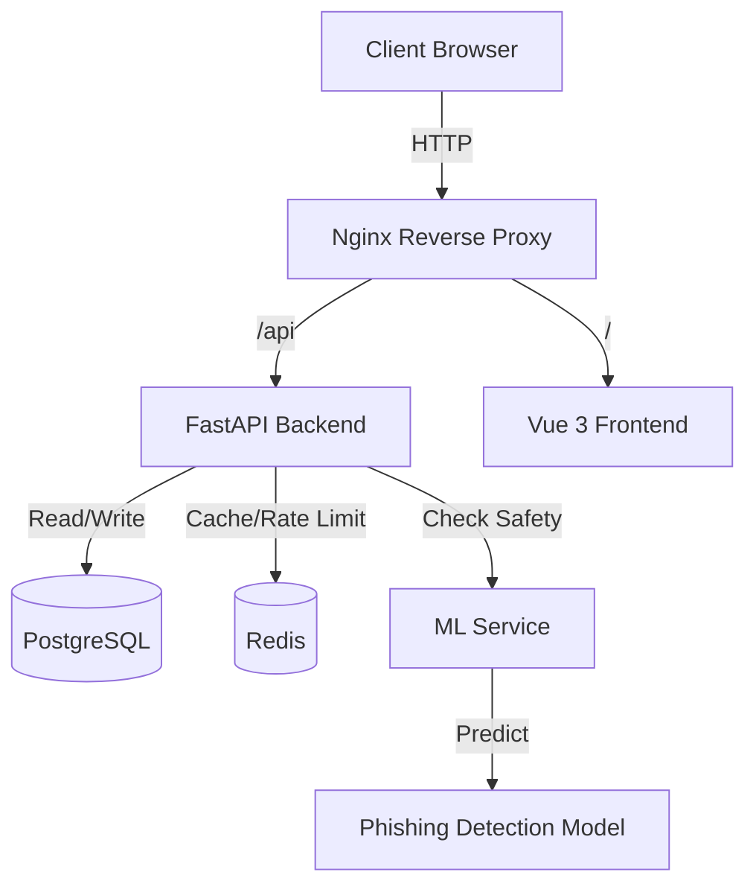

# 🚀 URL Shortener Platform

A professional, scalable, and modular URL Shortener Platform built with modern technologies.


## ✨ Features

- **🔐 User Authentication**: Secure Login and Registration system with JWT.
- **🔗 Secure URL Shortening**: Uses Hashids for non-predictable short IDs.
- **📱 QR Code Generation**: Instantly generate QR codes for any shortened URL.
- **📊 Advanced Analytics**: Tracks clicks, browsers, countries (GeoIP), OS, and referrers.
- **🛡️ ML-Powered Safety**: Integrated Machine Learning microservice to detect and block phishing/suspicious URLs.
- **⚡ High Performance**: Redis caching for instant redirections and rate limiting.
- **🎨 Modern Frontend**: Vue 3 + Vite + TailwindCSS for a responsive and elegant UI.
- **🐳 Dockerized**: Fully containerized for easy deployment anywhere.

## 🏗️ Architecture

The system follows a microservices-inspired architecture:



- **Frontend**: Vue 3 SPA (Port 3000)
- **Backend**: FastAPI (Port 8000)
- **Database**: PostgreSQL (Port 5432)
- **Cache**: Redis (Port 6379)
- **ML Service**: Python/FastAPI (Port 8001)

## 🚀 Getting Started

### Prerequisites
- Docker & Docker Compose

### Installation

1. **Clone the repository:**
   ```bash
   git clone <repository-url>
   cd urlshortener
   ```

2. **Start the services:**
   ```bash
   docker-compose up --build -d
   ```

3. **Access the application:**
   - **Frontend**: [https://shortter.matiasaquino.com/](https://shortter.matiasaquino.com/)
   - **API Docs**: [https://shortter-api.matiasaquino.com/docs](https://shortter-api.matiasaquino.com/docs)

## 🔧 Environment Variables

The project comes with a `.env.example`. Ensure you have the following set in your `docker-compose.yml` or `.env`:

- `DATABASE_URL`: PostgreSQL connection string.
- `REDIS_URL`: Redis connection string.
- `SECRET_KEY`: Secret key for JWT generation.
- `ML_SERVICE_URL`: URL for the ML microservice (default: `http://ml_service:8000`).

## 📡 API Endpoints

### 🔐 Authentication
- `POST /register`: Register a new user.
- `POST /token`: Login and get access token.
- `GET /users/me/urls`: Get URLs created by the logged-in user.

### 🔗 URL Management
- `POST /shorten`: Create a new short URL (Checks for safety first).
- `PUT /urls/{short_id}`: Update a target URL.
- `DELETE /urls/{short_id}`: Delete a short URL.
- `GET /{short_id}`: Redirect to the original URL.
- `GET /qr/{short_id}`: Get QR code for the URL.

### 📊 Analytics
- `GET /stats/{short_id}`: Get detailed analytics for a short URL.

### ⚙️ System
- `GET /health`: System health check.

## 🛠️ Development

### Project Structure
```
urlshortener/
├── backend/            # FastAPI Application (Auth, CRUD, Stats)
├── frontend/           # Vue 3 Application (Views, Components)
├── ml_service/         # ML Microservice (Phishing Detection)
├── docker-compose.yml  # Orchestration
└── README.md           # This file
```

### Running Tests
To run backend tests (requires local environment setup or running inside container):
```bash
cd backend
pytest
```

## 📦 Deployment

This project is designed to be deployed on any VPS (DigitalOcean, Linode, Hetzner, etc.) using Docker Compose.

1. Provision a VPS.
2. Install Docker & Docker Compose.
3. Clone repo and run `docker-compose up -d`.
4. Configure Nginx (host level) as a reverse proxy if needed for SSL/Domain mapping.

## 📄 License

MIT